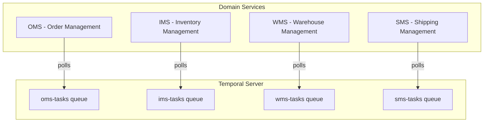
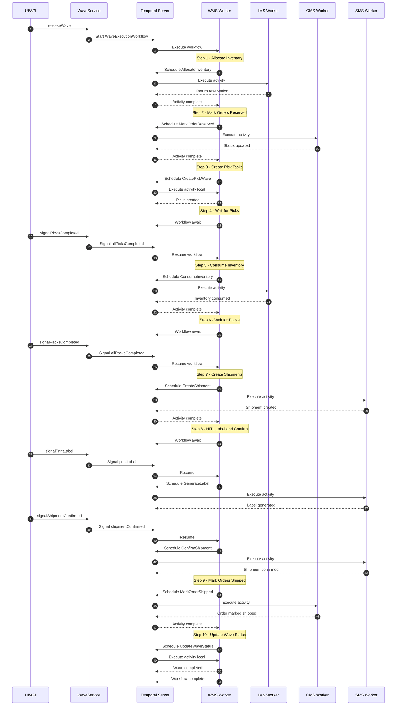
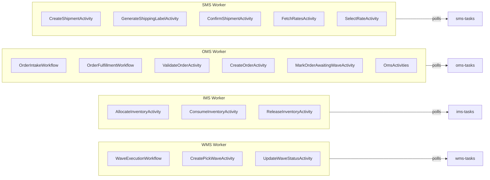
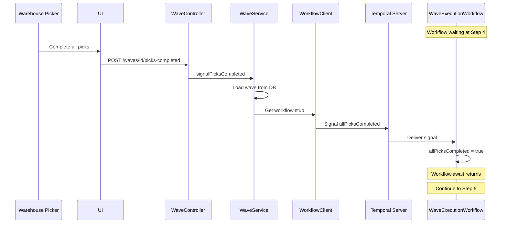
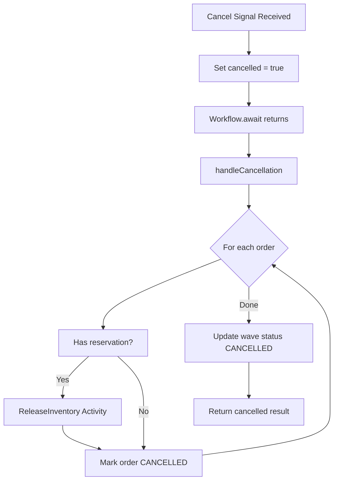

# WaveExecutionWorkflow Deep Dive

This document provides a comprehensive technical explanation of how the `WaveExecutionWorkflow` orchestrates distributed order fulfillment across the Tempest WMS microservices architecture.

---

## Table of Contents

1. [Introduction and Architecture Context](#introduction-and-architecture-context)
2. [High-Level Flow](#high-level-flow)
3. [Detailed Step-by-Step Breakdown](#detailed-step-by-step-breakdown)
4. [Worker Configuration](#worker-configuration)
5. [Signal Flow (Human-in-the-Loop)](#signal-flow-human-in-the-loop)
6. [Activity vs Spring Service](#activity-vs-spring-service)
7. [Error Handling and Compensation](#error-handling-and-compensation)
8. [Query Methods](#query-methods)
9. [Key Code References](#key-code-references)

---

## Introduction and Architecture Context

### Temporal's Role

Temporal serves as the **durable orchestrator of business intent** in Tempest. It coordinates long-running, multi-step business processes across distributed services without those services needing to communicate directly with each other.

Key principles:

-    **Temporal owns intent, not data** — Workflows express _what must happen_; services own _what exists_
-    **Every Activity is idempotent** — Activities may run multiple times; duplicate side effects must be impossible
-    **Workflows assume services can disappear** — All calls are retried; timeouts and failure states are explicit

### Workflow Code vs Activity Code

| Aspect          | Workflow Code                                             | Activity Code                                   |
| --------------- | --------------------------------------------------------- | ----------------------------------------------- |
| **Execution**   | Runs on the workflow's task queue worker                  | Runs on the target activity's task queue worker |
| **Determinism** | Must be deterministic (no I/O, no random, no system time) | Can have side effects (database, API calls)     |
| **State**       | Automatically persisted by Temporal                       | Stateless; results returned to workflow         |
| **Retries**     | Workflow replays from history                             | Activities retry independently                  |
| **Example**     | Decision logic, loops, waiting                            | Database writes, external API calls             |

### The Four Services



| Service | Task Queue  | Owns                                            |
| ------- | ----------- | ----------------------------------------------- |
| **OMS** | `oms-tasks` | Orders, Order Lines, Order Status, Order Events |
| **IMS** | `ims-tasks` | Items, BOM, Inventory Balance, Reservations     |
| **WMS** | `wms-tasks` | Facilities, Waves, Pick Tasks, Packing          |
| **SMS** | `sms-tasks` | Shipments, Parcels, Labels, Tracking            |

---

## High-Level Flow

The `WaveExecutionWorkflow` coordinates batch fulfillment of orders in a wave. Here's the complete flow from wave release to shipment:



---

## Detailed Step-by-Step Breakdown

### Step 1: Allocate Inventory

| Aspect           | Details                                            |
| ---------------- | -------------------------------------------------- |
| **Worker**       | IMS Worker (`ims-tasks`)                           |
| **Activity**     | `ImsActivities.allocate()`                         |
| **What Happens** | Creates inventory reservations for each order line |
| **Idempotency**  | Reservation ID based on orderId + SKU              |

```java
// In WaveExecutionWorkflowImpl
for (WaveOrderDTO order : request.getOrders()) {
    try {
        allocateInventoryForOrder(order);
        orderStatuses.put(order.getOrderId(), "ALLOCATED");
        ordersAllocated++;
    } catch (Exception e) {
        orderStatuses.put(order.getOrderId(), "ALLOCATION_FAILED");
        failedOrderIds.add(order.getOrderId());
    }
}
```

The activity stub targets the IMS queue:

```java
private final ImsActivities imsActivities = Workflow.newActivityStub(
    ImsActivities.class,
    ActivityOptions.newBuilder(defaultActivityOptions)
        .setTaskQueue(TaskQueues.IMS)  // "ims-tasks"
        .build());
```

---

### Step 2: Mark Orders Reserved

| Aspect           | Details                                                 |
| ---------------- | ------------------------------------------------------- |
| **Worker**       | OMS Worker (`oms-tasks`)                                |
| **Activity**     | `OmsActivities.markOrderReserved()`                     |
| **What Happens** | Updates order status from `AWAITING_WAVE` to `RESERVED` |
| **Idempotency**  | Order status transition is idempotent                   |

```java
for (WaveOrderDTO order : request.getOrders()) {
    if (failedOrderIds.contains(order.getOrderId())) continue;

    MarkOrderReservedRequest reservedRequest = MarkOrderReservedRequest.builder()
        .orderId(order.getOrderId())
        .reservationId(orderReservationIds.get(order.getOrderId()))
        .build();
    omsActivities.markOrderReserved(reservedRequest);
    orderStatuses.put(order.getOrderId(), "RESERVED");
}
```

---

### Step 3: Create Pick Tasks

| Aspect           | Details                                           |
| ---------------- | ------------------------------------------------- |
| **Worker**       | WMS Worker (`wms-tasks`) — **LOCAL**              |
| **Activity**     | `CreatePickWaveActivity.createPickWave()`         |
| **What Happens** | Creates pick task records in WMS database         |
| **Why Local**    | WMS owns pick tasks; no cross-service call needed |

```java
// Activity runs on same queue as workflow (wms-tasks)
private final CreatePickWaveActivity createPickWaveActivity = Workflow.newActivityStub(
    CreatePickWaveActivity.class,
    defaultActivityOptions);  // No setTaskQueue() - uses workflow's queue
```

---

### Step 4: Wait for Picks Signal

| Aspect           | Details                                          |
| ---------------- | ------------------------------------------------ |
| **Worker**       | WMS Worker (workflow pauses)                     |
| **Mechanism**    | `Workflow.await()`                               |
| **What Happens** | Workflow durably waits for human signal          |
| **Trigger**      | Warehouse workers complete picking, UI calls API |

```java
currentStep = "WAITING_FOR_PICKS";
blockingReason = "Waiting for all picks to complete";

Workflow.await(() -> allPicksCompleted || cancelled);
blockingReason = null;
```

The signal handler:

```java
@Override
public void allPicksCompleted() {
    this.allPicksCompleted = true;
}
```

---

### Step 5: Consume Inventory

| Aspect           | Details                                              |
| ---------------- | ---------------------------------------------------- |
| **Worker**       | IMS Worker (`ims-tasks`)                             |
| **Activity**     | `ImsActivities.consumeInventory()`                   |
| **What Happens** | Converts reservations to actual inventory deductions |
| **Idempotency**  | Uses reservation ID to prevent double consumption    |

```java
for (WaveOrderDTO order : request.getOrders()) {
    if (failedOrderIds.contains(order.getOrderId())) continue;

    consumeInventoryForOrder(order);
    orderStatuses.put(order.getOrderId(), "PICKED");
    ordersPicked++;
}
```

---

### Step 6: Wait for Packs Signal

| Aspect           | Details                                       |
| ---------------- | --------------------------------------------- |
| **Worker**       | WMS Worker (workflow pauses)                  |
| **Mechanism**    | `Workflow.await()`                            |
| **What Happens** | Workflow durably waits for packing completion |
| **Trigger**      | Packers complete work, UI calls API           |

```java
currentStep = "WAITING_FOR_PACKS";
status = "PACKING";
blockingReason = "Waiting for all packs to complete";

Workflow.await(() -> allPacksCompleted || cancelled);
```

---

### Step 7: Create Shipments

| Aspect           | Details                                         |
| ---------------- | ----------------------------------------------- |
| **Worker**       | SMS Worker (`sms-tasks`)                        |
| **Activity**     | `SmsActivities.createShipment()`                |
| **What Happens** | Creates shipment records with ship-to addresses |
| **Idempotency**  | Checks for existing shipment by orderId         |

```java
for (WaveOrderDTO order : request.getOrders()) {
    if (failedOrderIds.contains(order.getOrderId())) continue;

    try {
        ShipmentStateDTO shipmentState = createShipmentForOrder(order, request.getFacilityId());
        shipmentStates.put(shipmentState.getShipmentId(), shipmentState);
        orderToShipmentMap.put(order.getOrderId(), shipmentState.getShipmentId());
    } catch (Exception e) {
        orderStatuses.put(order.getOrderId(), "SHIPMENT_FAILED");
        failedOrderIds.add(order.getOrderId());
    }
}
```

---

### Step 8: HITL Shipment Processing

| Aspect           | Details                                                        |
| ---------------- | -------------------------------------------------------------- |
| **Worker**       | WMS Worker (orchestrates) + SMS Worker (activities)            |
| **Signals**      | `rateSelected`, `printLabel`, `shipmentConfirmed`              |
| **What Happens** | Human-driven flow: select rate → print label → confirm shipped |

This step uses a loop that processes signals as they arrive:

```java
while (!allShipmentsConfirmed() && !cancelled) {
    Workflow.await(() -> !shipmentsToGenerateLabel.isEmpty() ||
                         !shipmentsToConfirm.isEmpty() ||
                         allShipmentsConfirmed() ||
                         cancelled);

    // Process pending label generations
    for (Long shipmentId : new HashSet<>(shipmentsToGenerateLabel)) {
        shipmentsToGenerateLabel.remove(shipmentId);
        generateLabelForShipment(shipmentId);  // Calls SMS activity
    }

    // Process pending confirmations
    for (Long shipmentId : new HashSet<>(shipmentsToConfirm)) {
        shipmentsToConfirm.remove(shipmentId);
        confirmShipment(shipmentId);  // Calls SMS activity
    }
}
```

Signal handlers update workflow state:

```java
@Override
public void printLabel(Long shipmentId) {
    ShipmentStateDTO shipment = shipmentStates.get(shipmentId);
    if (shipment != null &&
        ("CREATED".equals(shipment.getStatus()) || "RATE_SELECTED".equals(shipment.getStatus()))) {
        shipmentsToGenerateLabel.add(shipmentId);
    }
}

@Override
public void shipmentConfirmed(Long shipmentId) {
    ShipmentStateDTO shipment = shipmentStates.get(shipmentId);
    if (shipment != null && "LABEL_GENERATED".equals(shipment.getStatus())) {
        shipmentsToConfirm.add(shipmentId);
    }
}
```

---

### Step 9: Mark Orders Shipped

| Aspect           | Details                                              |
| ---------------- | ---------------------------------------------------- |
| **Worker**       | OMS Worker (`oms-tasks`)                             |
| **Activity**     | `OmsActivities.markOrderShipped()`                   |
| **What Happens** | Updates order status to `SHIPPED` with tracking info |

```java
for (ShipmentStateDTO shipment : shipmentStates.values()) {
    if ("SHIPPED".equals(shipment.getStatus())) {
        MarkOrderShippedRequest shippedRequest = MarkOrderShippedRequest.builder()
            .orderId(shipment.getOrderId())
            .shipmentId(shipment.getShipmentId())
            .trackingNumber(shipment.getTrackingNumber())
            .carrier(shipment.getCarrier())
            .build();
        omsActivities.markOrderShipped(shippedRequest);

        orderStatuses.put(shipment.getOrderId(), "SHIPPED");
        ordersShipped++;
    }
}
```

---

### Step 10: Update Wave Status

| Aspect           | Details                                            |
| ---------------- | -------------------------------------------------- |
| **Worker**       | WMS Worker (`wms-tasks`) — **LOCAL**               |
| **Activity**     | `UpdateWaveStatusActivity.updateStatus()`          |
| **What Happens** | Updates wave record to `COMPLETED` in WMS database |
| **Why Local**    | WMS owns waves; no cross-service call needed       |

```java
UpdateWaveStatusRequest updateRequest = UpdateWaveStatusRequest.builder()
    .tenantId(tenantId)
    .waveId(waveId)
    .status("COMPLETED")
    .build();
updateWaveStatusActivity.updateStatus(updateRequest);

currentStep = "COMPLETED";
status = "COMPLETED";
```

---

## Worker Configuration

Each service configures its Temporal worker to poll its designated task queue and register its activities:



### WMS Worker Configuration

```java
// wms/src/main/java/app/tempest/wms/config/TemporalWorkerConfig.java
Worker worker = factory.newWorker(TaskQueues.WMS);

worker.registerWorkflowImplementationTypes(WaveExecutionWorkflowImpl.class);
worker.registerActivitiesImplementations(
    createPickWaveActivity,
    updateWaveStatusActivity);
```

### IMS Worker Configuration

```java
// ims/src/main/java/app/tempest/ims/config/TemporalWorkerConfig.java
Worker worker = factory.newWorker(TaskQueues.IMS);

worker.registerActivitiesImplementations(
    allocateInventoryActivity,
    releaseInventoryActivity,
    consumeInventoryActivity);
```

### OMS Worker Configuration

```java
// oms/src/main/java/app/tempest/oms/config/TemporalWorkerConfig.java
Worker worker = factory.newWorker(TaskQueues.OMS);

worker.registerWorkflowImplementationTypes(
    OrderIntakeWorkflowImpl.class,
    OrderFulfillmentWorkflowImpl.class);
worker.registerActivitiesImplementations(
    validateOrderActivity,
    createOrderActivity,
    markOrderAwaitingWaveActivity,
    markOrderReservedActivity,
    markOrderShippedActivity,
    omsActivities);
```

### SMS Worker Configuration

```java
// sms/src/main/java/app/tempest/sms/config/TemporalWorkerConfig.java
Worker worker = factory.newWorker(TaskQueues.SMS);

worker.registerActivitiesImplementations(
    createShipmentActivity,
    generateShippingLabelActivity,
    confirmShipmentActivity,
    fetchRatesActivity,
    selectRateActivity);
```

---

## Signal Flow (Human-in-the-Loop)

Signals allow external events (human actions) to influence a running workflow. The `WaveService` Spring service acts as the bridge between HTTP APIs and Temporal signals.



### Signal Methods in WaveService

```java
// wms/src/main/java/app/tempest/wms/service/WaveService.java

public void signalPicksCompleted(String tenantId, Long waveId) {
    Wave wave = waveRepository.findByTenantIdAndId(tenantId, waveId)
        .orElseThrow(() -> new IllegalArgumentException("Wave not found"));

    WaveExecutionWorkflow workflow = workflowClient.newWorkflowStub(
        WaveExecutionWorkflow.class, wave.getWorkflowId());
    workflow.allPicksCompleted();
}

public void signalPacksCompleted(String tenantId, Long waveId) {
    Wave wave = waveRepository.findByTenantIdAndId(tenantId, waveId)
        .orElseThrow(() -> new IllegalArgumentException("Wave not found"));

    WaveExecutionWorkflow workflow = workflowClient.newWorkflowStub(
        WaveExecutionWorkflow.class, wave.getWorkflowId());
    workflow.allPacksCompleted();
}

public void signalPrintLabel(String tenantId, Long waveId, Long shipmentId) {
    Wave wave = waveRepository.findByTenantIdAndId(tenantId, waveId)
        .orElseThrow(() -> new IllegalArgumentException("Wave not found"));

    WaveExecutionWorkflow workflow = workflowClient.newWorkflowStub(
        WaveExecutionWorkflow.class, wave.getWorkflowId());
    workflow.printLabel(shipmentId);
}

public void signalShipmentConfirmed(String tenantId, Long waveId, Long shipmentId) {
    Wave wave = waveRepository.findByTenantIdAndId(tenantId, waveId)
        .orElseThrow(() -> new IllegalArgumentException("Wave not found"));

    WaveExecutionWorkflow workflow = workflowClient.newWorkflowStub(
        WaveExecutionWorkflow.class, wave.getWorkflowId());
    workflow.shipmentConfirmed(shipmentId);
}
```

### Available Signals

| Signal                                            | Purpose                       | Sent When                        |
| ------------------------------------------------- | ----------------------------- | -------------------------------- |
| `allPicksCompleted()`                             | Resume workflow after picking | All pick tasks in wave completed |
| `allPacksCompleted()`                             | Resume workflow after packing | All orders packed                |
| `orderPickCompleted(orderId)`                     | Track individual order        | Single order's picks done        |
| `orderPackCompleted(orderId)`                     | Track individual order        | Single order packed              |
| `rateSelected(shipmentId, carrier, serviceLevel)` | Select shipping rate          | User chooses carrier/service     |
| `printLabel(shipmentId)`                          | Trigger label generation      | User clicks "Print Label"        |
| `shipmentConfirmed(shipmentId)`                   | Confirm shipment              | User confirms package shipped    |
| `cancelWave(reason)`                              | Cancel entire wave            | Admin cancels wave               |

---

## Activity vs Spring Service

Understanding when to use Temporal Activities vs direct Spring Service calls is crucial:

### Comparison Table

| Aspect         | Temporal Activity                    | Spring Service                |
| -------------- | ------------------------------------ | ----------------------------- |
| **Use When**   | Cross-service calls, needs retries   | Local operations, simple CRUD |
| **Execution**  | On target service's worker           | In current service's JVM      |
| **Durability** | Automatically retried on failure     | No built-in retry             |
| **State**      | Result persisted in workflow history | Not persisted                 |
| **Example**    | `imsActivities.allocate()`           | `waveRepository.save()`       |

### In WaveExecutionWorkflow

| Operation           | Type                | Why                                    |
| ------------------- | ------------------- | -------------------------------------- |
| Allocate inventory  | **Remote Activity** | IMS owns inventory; needs retries      |
| Mark order reserved | **Remote Activity** | OMS owns orders; needs retries         |
| Create pick tasks   | **Local Activity**  | WMS owns picks; still needs durability |
| Update wave status  | **Local Activity**  | WMS owns waves; still needs durability |
| Create shipment     | **Remote Activity** | SMS owns shipments; needs retries      |
| Generate label      | **Remote Activity** | SMS owns labels; needs retries         |

### In WaveService (Spring)

| Operation                      | Type                | Why                           |
| ------------------------------ | ------------------- | ----------------------------- |
| `waveRepository.save()`        | **Spring Service**  | Simple CRUD, no orchestration |
| `workflowClient.start()`       | **Temporal Client** | Starting a workflow           |
| `workflow.allPicksCompleted()` | **Temporal Signal** | Sending signal to workflow    |
| `workflow.getCurrentStep()`    | **Temporal Query**  | Querying workflow state       |

### Key Insight

**WaveService** (Spring) handles:

-    Wave CRUD operations (create, read, update)
-    Starting the workflow
-    Sending signals to the workflow
-    Querying workflow state for UI

**WaveExecutionWorkflow** (Temporal) handles:

-    Orchestrating the multi-step fulfillment process
-    Calling activities on remote services
-    Waiting for human signals
-    Handling failures and compensation

---

## Error Handling and Compensation

### Retry Policies

All activities are configured with retry policies:

```java
private final ActivityOptions defaultActivityOptions = ActivityOptions.newBuilder()
    .setStartToCloseTimeout(Duration.ofSeconds(30))
    .setRetryOptions(RetryOptions.newBuilder()
        .setMaximumAttempts(5)
        .setInitialInterval(Duration.ofSeconds(1))
        .setBackoffCoefficient(2.0)
        .build())
    .build();
```

This means:

-    First retry: 1 second delay
-    Second retry: 2 seconds delay
-    Third retry: 4 seconds delay
-    Fourth retry: 8 seconds delay
-    Fifth attempt: 16 seconds delay
-    After 5 failures: Activity fails permanently

### Per-Order Failure Handling

The workflow continues processing other orders even if one fails:

```java
for (WaveOrderDTO order : request.getOrders()) {
    try {
        allocateInventoryForOrder(order);
        orderStatuses.put(order.getOrderId(), "ALLOCATED");
        ordersAllocated++;
    } catch (Exception e) {
        // Mark this order as failed, but continue with others
        orderStatuses.put(order.getOrderId(), "ALLOCATION_FAILED");
        failedOrderIds.add(order.getOrderId());
        ordersFailed++;
    }
}
```

### Cancellation and Compensation

When a wave is cancelled, the workflow releases all reserved inventory:



```java
private WaveExecutionResult handleCancellation(WaveExecutionRequest request) {
    status = "CANCELLED";
    currentStep = "RELEASING_INVENTORY";

    // Release inventory for all allocated orders
    for (WaveOrderDTO order : request.getOrders()) {
        String reservationId = orderReservationIds.get(order.getOrderId());
        if (reservationId != null) {
            ReleaseInventoryRequest releaseRequest = ReleaseInventoryRequest.builder()
                .orderId(String.valueOf(order.getOrderId()))
                .reservationId(reservationId)
                .reason(cancellationReason)
                .build();
            imsActivities.releaseInventory(releaseRequest);
        }
        orderStatuses.put(order.getOrderId(), "CANCELLED");
    }

    // Update wave status
    UpdateWaveStatusRequest updateRequest = UpdateWaveStatusRequest.builder()
        .tenantId(tenantId)
        .waveId(waveId)
        .status("CANCELLED")
        .build();
    updateWaveStatusActivity.updateStatus(updateRequest);

    return WaveExecutionResult.builder()
        .waveId(waveId)
        .finalStatus("CANCELLED")
        .totalOrders(totalOrders)
        .successfulOrders(0)
        .failedOrders(totalOrders)
        .build();
}
```

---

## Query Methods

Temporal queries allow reading workflow state without affecting execution. The UI uses these to display real-time status.

### Available Queries

```java
@QueryMethod
WaveStatusDTO getWaveStatus();

@QueryMethod
String getCurrentStep();

@QueryMethod
String getBlockingReason();

@QueryMethod
Map<Long, ShipmentStateDTO> getShipmentStates();
```

### getWaveStatus() Implementation

```java
@Override
public WaveStatusDTO getWaveStatus() {
    return WaveStatusDTO.builder()
        .waveId(waveId)
        .status(status)
        .currentStep(currentStep)
        .blockingReason(blockingReason)
        .totalOrders(totalOrders)
        .ordersAllocated(ordersAllocated)
        .ordersPicked(ordersPicked)
        .ordersPacked(ordersPacked)
        .ordersShipped(ordersShipped)
        .ordersFailed(ordersFailed)
        .orderStatuses(new HashMap<>(orderStatuses))
        .failedOrderIds(new ArrayList<>(failedOrderIds))
        .build();
}
```

### Querying from WaveService

```java
public WorkflowStatusResponse getWorkflowStatus(String tenantId, Long waveId) {
    Wave wave = waveRepository.findByTenantIdAndId(tenantId, waveId)
        .orElseThrow(() -> new IllegalArgumentException("Wave not found"));

    if (wave.getWorkflowId() == null) {
        return WorkflowStatusResponse.builder()
            .status(wave.getStatus().name())
            .build();
    }

    try {
        WaveExecutionWorkflow workflow = workflowClient.newWorkflowStub(
            WaveExecutionWorkflow.class, wave.getWorkflowId());

        String currentStep = workflow.getCurrentStep();
        String blockingReason = workflow.getBlockingReason();

        return WorkflowStatusResponse.builder()
            .status(wave.getStatus().name())
            .currentStep(currentStep)
            .blockingReason(blockingReason)
            .build();
    } catch (Exception e) {
        // Workflow may have completed
        return WorkflowStatusResponse.builder()
            .status(wave.getStatus().name())
            .build();
    }
}
```

---

## Key Code References

| File                                                                                      | Purpose                                  |
| ----------------------------------------------------------------------------------------- | ---------------------------------------- |
| `wms/src/main/java/app/tempest/wms/temporal/workflow/impl/WaveExecutionWorkflowImpl.java` | Main workflow implementation             |
| `wms/src/main/java/app/tempest/wms/temporal/workflow/WaveExecutionWorkflow.java`          | Workflow interface with signals/queries  |
| `wms/src/main/java/app/tempest/wms/service/WaveService.java`                              | Spring service for wave CRUD and signals |
| `wms/src/main/java/app/tempest/wms/config/TemporalWorkerConfig.java`                      | WMS worker configuration                 |
| `ims/src/main/java/app/tempest/ims/config/TemporalWorkerConfig.java`                      | IMS worker configuration                 |
| `oms/src/main/java/app/tempest/oms/config/TemporalWorkerConfig.java`                      | OMS worker configuration                 |
| `sms/src/main/java/app/tempest/sms/config/TemporalWorkerConfig.java`                      | SMS worker configuration                 |
| `tempest-common/src/main/java/app/tempest/common/temporal/TaskQueues.java`                | Task queue constants                     |
| `wms/src/main/java/app/tempest/wms/temporal/activities/remote/ImsActivities.java`         | IMS activity interface (WMS side)        |
| `wms/src/main/java/app/tempest/wms/temporal/activities/remote/SmsActivities.java`         | SMS activity interface (WMS side)        |
| `tempest-common/src/main/java/app/tempest/common/temporal/activities/OmsActivities.java`  | OMS activity interface (shared)          |

---

## Summary

The `WaveExecutionWorkflow` demonstrates Temporal's power for orchestrating distributed systems:

1. **Durable Execution** — Workflow state survives service restarts
2. **Cross-Service Coordination** — Activities execute on different workers without direct service-to-service calls
3. **Human-in-the-Loop** — Workflows can wait indefinitely for human actions via signals
4. **Compensation** — Clean rollback of inventory on cancellation
5. **Visibility** — Query methods provide real-time status for UI
6. **Resilience** — Automatic retries with exponential backoff

The key architectural insight is the separation of concerns:

-    **Spring Services** handle CRUD and act as the API layer
-    **Temporal Workflows** handle orchestration and durability
-    **Temporal Activities** handle the actual work with retry guarantees
