# Temporal Activity Routing Architecture

This document explains how cross-service Temporal activities are organized and routed in the Tempest WMS system.

## Architecture Diagram

```mermaid
flowchart TB
    subgraph tempestCommon [tempest-common - Shared Activity Interfaces]
        subgraph imsInterfaces [ims/]
            ImsActivities["ImsActivities<br/>• allocate()<br/>• releaseInventory()<br/>• consumeInventory()"]
        end
        subgraph omsInterfaces [oms/]
            OmsActivities["OmsActivities<br/>• markOrderReserved()<br/>• markOrderShipped()"]
        end
        subgraph smsInterfaces [sms/]
            SmsActivities["SmsActivities<br/>• createShipment()<br/>• generateLabel()<br/>• confirmShipment()<br/>• fetchRates()<br/>• selectRate()"]
            FetchFedEx["FetchFedExRatesActivity"]
            FetchUPS["FetchUPSRatesActivity"]
            FetchUSPS["FetchUSPSRatesActivity"]
        end
        subgraph wmsInterfaces [wms/]
            WmsActivities["WmsActivities<br/>• createPickWave()"]
        end
    end

    subgraph temporal [Temporal Server]
        IMSQueue[["ims-tasks queue"]]
        OMSQueue[["oms-tasks queue"]]
        SMSQueue[["sms-tasks queue"]]
        WMSQueue[["wms-tasks queue"]]
    end

    subgraph imsService [IMS Service]
        ImsActivitiesImpl["ImsActivitiesImpl"]
        ImsWorker["IMS Worker"]
    end

    subgraph omsService [OMS Service]
        OmsActivitiesImpl["OmsActivitiesImpl"]
        OmsWorker["OMS Worker"]
        OrderFulfillmentWF["OrderFulfillmentWorkflow"]
    end

    subgraph smsService [SMS Service]
        SmsActivitiesImpl["SmsActivitiesImpl"]
        FetchFedExImpl["FetchFedExRatesActivityImpl"]
        FetchUPSImpl["FetchUPSRatesActivityImpl"]
        FetchUSPSImpl["FetchUSPSRatesActivityImpl"]
        SmsWorker["SMS Worker"]
    end

    subgraph wmsService [WMS Service]
        WmsActivitiesImpl["WmsActivitiesImpl"]
        WmsWorker["WMS Worker"]
        WaveExecutionWF["WaveExecutionWorkflow"]
    end

    %% Interface implementations
    ImsActivities -.->|implements| ImsActivitiesImpl
    OmsActivities -.->|implements| OmsActivitiesImpl
    SmsActivities -.->|implements| SmsActivitiesImpl
    FetchFedEx -.->|implements| FetchFedExImpl
    FetchUPS -.->|implements| FetchUPSImpl
    FetchUSPS -.->|implements| FetchUSPSImpl
    WmsActivities -.->|implements| WmsActivitiesImpl

    %% Worker registrations
    ImsActivitiesImpl --> ImsWorker
    ImsWorker -->|polls| IMSQueue

    OmsActivitiesImpl --> OmsWorker
    OmsWorker -->|polls| OMSQueue

    SmsActivitiesImpl --> SmsWorker
    FetchFedExImpl --> SmsWorker
    FetchUPSImpl --> SmsWorker
    FetchUSPSImpl --> SmsWorker
    SmsWorker -->|polls| SMSQueue

    WmsActivitiesImpl --> WmsWorker
    WmsWorker -->|polls| WMSQueue

    %% Cross-service calls from WaveExecutionWorkflow
    WaveExecutionWF -->|"imsActivities.allocate()"| IMSQueue
    WaveExecutionWF -->|"omsActivities.markOrderReserved()"| OMSQueue
    WaveExecutionWF -->|"smsActivities.createShipment()"| SMSQueue
    WaveExecutionWF -->|"fetchFedExRates()"| SMSQueue
    WaveExecutionWF -->|"wmsActivities.createPickWave()"| WMSQueue

    %% Cross-service calls from OrderFulfillmentWorkflow
    OrderFulfillmentWF -->|"imsActivities.allocate()"| IMSQueue
    OrderFulfillmentWF -->|"smsActivities.createShipment()"| SMSQueue
    OrderFulfillmentWF -->|"wmsActivities.createPickWave()"| WMSQueue
```



## Key Concepts

### 1. Shared Interfaces in tempest-common

All cross-service activity interfaces live in `tempest-common`, organized by the service that **implements** them:

```
tempest-common/src/main/java/app/tempest/common/temporal/activities/
├── ims/
│   └── ImsActivities.java          # IMS implements these
├── oms/
│   └── OmsActivities.java          # OMS implements these
├── sms/
│   ├── SmsActivities.java          # SMS implements these
│   ├── FetchFedExRatesActivity.java
│   ├── FetchUPSRatesActivity.java
│   └── FetchUSPSRatesActivity.java
└── wms/
    └── WmsActivities.java          # WMS implements these
```

### 2. Why Shared Interfaces?

The shared interface serves as a **contract** between caller and implementer:

- **Caller (e.g., WMS)** needs the interface to create activity stubs and know what methods/parameters to use
- **Implementer (e.g., IMS)** needs the interface to implement the correct methods
- **Temporal** handles serialization, routing, and execution

Without shared interfaces, you'd have to manually manage JSON schemas or use untyped APIs.

### 3. Activity Stub Creation (Caller Side)

When a workflow wants to call a remote activity, it creates a stub with the **target task queue**:

```java
// In WaveExecutionWorkflow (runs in WMS)
ImsActivities imsActivities = Workflow.newActivityStub(
    ImsActivities.class,
    ActivityOptions.newBuilder()
        .setTaskQueue(TaskQueues.IMS)  // Routes to IMS!
        .build());

// Now this call goes to IMS service
imsActivities.allocate(request);
```

### 4. Activity Registration (Implementer Side)

Each service registers its implementation with its worker:

```java
// In IMS TemporalWorkerConfig
Worker worker = factory.newWorker(TaskQueues.IMS);
worker.registerActivitiesImplementations(imsActivitiesImpl);
```

### 5. The Complete Flow

1. **WMS workflow** calls `imsActivities.allocate(request)`
2. **Temporal** serializes the request and schedules a task on the `ims-tasks` queue
3. **IMS worker** polls the queue and picks up the task
4. **ImsActivitiesImpl.allocate()** executes with the deserialized request
5. **Result** is serialized and returned through Temporal to the WMS workflow

```
WMS Workflow                    Temporal Server                    IMS Worker
     │                               │                                 │
     │  1. Call imsActivities        │                                 │
     │     .allocate(request)        │                                 │
     │  ─────────────────────────────▶                                 │
     │                               │                                 │
     │                               │  2. Schedule activity task      │
     │                               │     on "ims-tasks" queue        │
     │                               │  ─────────────────────────────▶ │
     │                               │                                 │
     │       (WMS workflow is        │                                 │ 3. IMS worker polls,
     │        now waiting...)        │                                 │    picks up task,
     │                               │                                 │    executes ImsActivitiesImpl
     │                               │                                 │    .allocate()
     │                               │                                 │
     │                               │  4. Activity result             │
     │                               │  ◀───────────────────────────── │
     │                               │                                 │
     │  5. Result returned           │                                 │
     │     to workflow               │                                 │
     │  ◀─────────────────────────────                                 │
     │                               │                                 │
```

## Task Queues

| Queue Name | Service | Activities Registered |
|------------|---------|----------------------|
| `ims-tasks` | IMS | `ImsActivitiesImpl` |
| `oms-tasks` | OMS | `OmsActivitiesImpl` + internal activities |
| `sms-tasks` | SMS | `SmsActivitiesImpl` + carrier rate activities |
| `wms-tasks` | WMS | `WmsActivitiesImpl` + internal activities |

## Cross-Service Activity Matrix

| Activity | Defined In | Implemented By | Called By |
|----------|-----------|----------------|-----------|
| `ImsActivities.allocate()` | tempest-common | IMS | OMS, WMS |
| `ImsActivities.releaseInventory()` | tempest-common | IMS | WMS |
| `ImsActivities.consumeInventory()` | tempest-common | IMS | WMS |
| `OmsActivities.markOrderReserved()` | tempest-common | OMS | WMS |
| `OmsActivities.markOrderShipped()` | tempest-common | OMS | WMS |
| `SmsActivities.createShipment()` | tempest-common | SMS | OMS, WMS |
| `SmsActivities.generateLabel()` | tempest-common | SMS | OMS, WMS |
| `SmsActivities.confirmShipment()` | tempest-common | SMS | OMS, WMS |
| `FetchFedExRatesActivity` | tempest-common | SMS | WMS |
| `FetchUPSRatesActivity` | tempest-common | SMS | WMS |
| `FetchUSPSRatesActivity` | tempest-common | SMS | WMS |
| `WmsActivities.createPickWave()` | tempest-common | WMS | OMS, WMS |

## Internal vs Cross-Service Activities

**Cross-service activities** (in tempest-common):
- Called by workflows in other services
- Interface must be shared so both sides agree on the contract

**Internal activities** (in service's own codebase):
- Only called by workflows within the same service
- No need to share the interface
- Examples: `CreateOrderActivity`, `ValidateOrderActivity` in OMS

## Best Practices

1. **Only share what crosses boundaries** - Internal activities stay in their service
2. **Organize by implementer** - Put interfaces in folders named after the implementing service
3. **Use consistent naming** - `XxxActivities` for the main interface, `XxxActivitiesImpl` for implementation
4. **Always specify task queue** - When creating stubs for remote activities, explicitly set the target queue
5. **Keep DTOs in tempest-common** - Request/response objects must be shared for serialization

